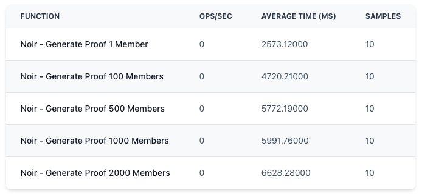

# Benchmarks - NOIR SEMAPHORE

Version details:
- `nargo version = 1.0.0-beta.3`
- `bb 0.82.2`

## SDK 

Benchmarks from `node`. 

Machine details:
- Computer: MacBook Pro
- Chip: Intel Core i7 (6-core, 2.6 GHz)
- Memory (RAM): 32 GB
- Operating System: macOS Ventura version 13.7.4

### Proof generation

| Function                          | ops/sec | Average Time (ms) | Samples |
|----------------------------------|---------|-------------------|---------|
| V4 - Generate Proof 1 Member     | 0       | 3738.18667        | 10      |
| V4 - Generate Proof 100 Members  | 0       | 3673.62110        | 10      |
| V4 - Generate Proof 500 Members  | 0       | 4133.49702        | 10      |
| V4 - Generate Proof 1000 Members | 0       | 4138.57592        | 10      |
| V4 - Generate Proof 2000 Members | 0       | 3977.99236        | 10      |

<!-- 
┌─────────┬────────────────────────────────────┬─────────┬───────────────────┬─────────┐
│ (index) │              Function              │ ops/sec │ Average Time (ms) │ Samples │
├─────────┼────────────────────────────────────┼─────────┼───────────────────┼─────────┤
│    0    │   'V4 - Generate Proof 1 Member'   │   '0'   │   '3738.18667'    │   10    │
│    1    │ 'V4 - Generate Proof 100 Members'  │   '0'   │   '3673.62110'    │   10    │
│    2    │ 'V4 - Generate Proof 500 Members'  │   '0'   │   '4133.49702'    │   10    │
│    3    │ 'V4 - Generate Proof 1000 Members' │   '0'   │   '4138.57592'    │   10    │
│    4    │ 'V4 - Generate Proof 2000 Members' │   '0'   │   '3977.99236'    │   10    │
└─────────┴────────────────────────────────────┴─────────┴───────────────────┴─────────┘
 -->

### Proof verification
```
yarn ts-node src/verify-proof.ts
```

| Function                          | ops/sec | Average Time (ms) | Samples |
|----------------------------------|---------|-------------------|---------|
| V4 - Verify Proof 1 Member       | 0       | 3263.38527        | 10      |
| V4 - Verify Proof 100 Members    | 0       | 3416.21023        | 10      |
| V4 - Verify Proof 500 Members    | 0       | 3412.76212        | 10      |
| V4 - Verify Proof 1000 Members   | 0       | 3436.98171        | 10      |
| V4 - Verify Proof 2000 Members   | 0       | 3368.20646        | 10      |

<!-- 
┌─────────┬──────────────────────────────────┬─────────┬───────────────────┬─────────┐
│ (index) │             Function             │ ops/sec │ Average Time (ms) │ Samples │
├─────────┼──────────────────────────────────┼─────────┼───────────────────┼─────────┤
│    0    │   'V4 - Verify Proof 1 Member'   │   '0'   │   '3263.38527'    │   10    │
│    1    │ 'V4 - Verify Proof 100 Members'  │   '0'   │   '3416.21023'    │   10    │
│    2    │ 'V4 - Verify Proof 500 Members'  │   '0'   │   '3412.76212'    │   10    │
│    3    │ 'V4 - Verify Proof 1000 Members' │   '0'   │   '3436.98171'    │   10    │
│    4    │ 'V4 - Verify Proof 2000 Members' │   '0'   │   '3368.20646'    │   10    │
└─────────┴──────────────────────────────────┴─────────┴───────────────────┴─────────┘
 -->

## Circuit

Gatecounts from `gatecount`. 

| MAX_DEPTH | acir_opcodes | circuit_size |
|-----------|--------------|--------------|
|         1 |         2822 |         7756 |
|         2 |         3149 |         8696 |
|         3 |         3476 |         9636 |
|         4 |         3803 |        10576 |
|         5 |         4130 |        11516 |
|         6 |         4457 |        12456 |
|         7 |         4784 |        13397 |
|         8 |         5111 |        14336 |
|         9 |         5438 |        15276 |
|        10 |         5765 |        16217 |
|        11 |         6092 |        17157 |
|        12 |         6419 |        18096 |
|        13 |         6746 |        19037 |
|        14 |         7073 |        19977 |
|        15 |         7400 |        20917 |
|        16 |         7727 |        21857 |
|        17 |         8054 |        22797 |
|        18 |         8381 |        23737 |
|        19 |         8708 |        24678 |
|        20 |         9035 |        25617 |
|        21 |         9362 |        26557 |
|        22 |         9689 |        27498 |
|        23 |        10016 |        28438 |
|        24 |        10343 |        29377 |
|        25 |        10670 |        30318 |
|        26 |        10997 |        31258 |
|        27 |        11324 |        32198 |
|        28 |        11651 |        33138 |
|        29 |        11978 |        34078 |
|        30 |        12305 |        35018 |
|        31 |        12632 |        35959 |
|        32 |        12959 |        36898 |

<!-- 
 MAX_DEPTH | acir_opcodes |   circuit_size
------------------------------------------
         1 |         2822 |           7756
         2 |         3149 |           8696
         3 |         3476 |           9636
         4 |         3803 |          10576
         5 |         4130 |          11516
         6 |         4457 |          12456
         7 |         4784 |          13397
         8 |         5111 |          14336
         9 |         5438 |          15276
        10 |         5765 |          16217
        11 |         6092 |          17157
        12 |         6419 |          18096
        13 |         6746 |          19037
        14 |         7073 |          19977
        15 |         7400 |          20917
        16 |         7727 |          21857
        17 |         8054 |          22797
        18 |         8381 |          23737
        19 |         8708 |          24678
        20 |         9035 |          25617
        21 |         9362 |          26557
        22 |         9689 |          27498
        23 |        10016 |          28438
        24 |        10343 |          29377
        25 |        10670 |          30318
        26 |        10997 |          31258
        27 |        11324 |          32198
        28 |        11651 |          33138
        29 |        11978 |          34078
        30 |        12305 |          35018
        31 |        12632 |          35959
        32 |        12959 |          36898
 -->

## Browser


